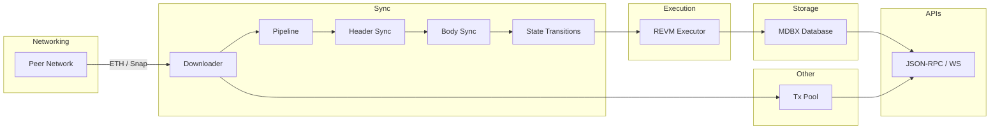

# Reth Orientation Overview

> **Purpose**: Provide a "mental map" before you deep-dive into each crate. Skim this once, then keep it open while reading code.

---

## 1. Project Goals

* **Library-first**: every subsystem is a crate that can be reused outside the full node.
* **Performance**: Rocks-in-MDBX + asynchronous download pipeline = fast sync.
* **Modularity**: consensus engine, execution engine, storage backend, and RPC can be swapped.
* **Correctness**: heavy property-testing, reference tests, and stage checkpoints to allow deterministic restarts.

---

## 2. Core Vocabulary

| Term | Meaning |
| ---- | ------- |
| *Stage* | A deterministic, resumable sub-step of syncing (e.g. `HeaderSync`, `BodySync`, `Execution`). |
| *Pipeline* | Ordered list of **stages** that are executed until the node reaches the chain tip. |
| *Checkpoint* | Last processed block number/hash for a stage stored in DB to enable resume. |
| *Primitives* | Fundamental types (`Block`, `Header`, `Tx`, …) shared across crates. |
| *Consensus Engine* | Trait + implementation that decides chain head & validates blocks (Ethash, Beacon, …). |
| *Executor* | Wrapper around **revm** that turns blocks into state changes & receipts. |

---

## 3. High-Level Data-Flow



---

## 4. Crate Map (top 10)

| Layer | Crate(s) | What to look for |
| ----- | -------- | ---------------- |
| Primitives | `primitives`, `primitives-traits`, `ethereum` | types & RLP. |
| Storage | `storage`, `fs-util`, `etl` | table layout, MDBX env, file utilities. |
| Execution | `evm`, `revm`, `executor` | REVM integration & state transition. |
| Consensus | `consensus` | engine traits, Ethash & Beacon implementations. |
| Sync | `stages`, `node/pipeline` | ordered stages, checkpoints. |
| P2P | `net`, `tasks` | peer management, sub-protocol mux. |
| Downloader | `era-downloader` | header/body request scheduling. |
| Tx Pool | `transaction-pool` | mempool with sub-pools & price rules. |
| RPC | `rpc`, `cli` | JSON-RPC server & command-line wiring. |
| Observability | `tracing`, `tracing-otlp`, `metrics` | logs, metrics, OTLP exporter. |

> Tip: run `cargo tree -p reth-node --prefix depth` to visualise the dependency graph.

---

## 5. Suggested First Commands

```bash
# Build everything
cargo build -p reth-node

# Start a dev chain (in-memory)
cargo run -p reth-node -- node --dev

# Generate docs to clickable HTML
cargo doc --workspace --no-deps --open
```

---

## 6. Next Step

Proceed to **1. Core Primitives** section in `learn_plan.md`. 